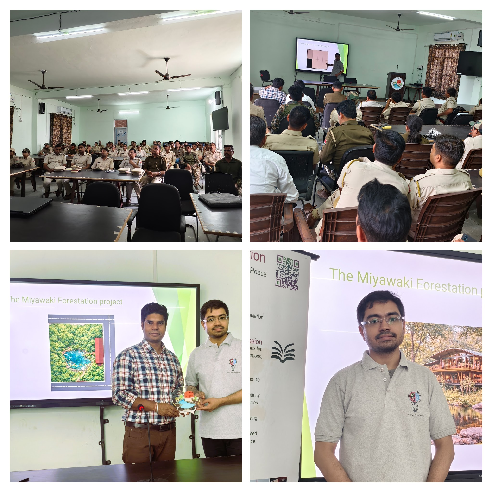

# GVan - Microforest Initiative  
*Miyawaki Forestation Project*

## Project Outreach

---

##  Overview
The **GVan – Microforest Initiative** is a nature restoration project based on the **Miyawaki Method**, a scientifically grounded approach to creating dense, native forests in a short time.

Developed by Japanese botanist **Akira Miyawaki**, this method enables forests to mature in **20–30 years**, compared to over 100 years using conventional approaches.

Our mission is to **restore ecological balance, enhance biodiversity, and combat climate change** through sustainable afforestation.

---

## Problem Statement
Global deforestation has led to:
- Loss of forests
- Billion tonnes of CO₂ emissions annually  
- Soil degradation and biodiversity loss  

There is an urgent need for **fast, scalable, and ecologically sound restoration methods**.

---

## What is the Miyawaki Method?
The Miyawaki Method focuses on:
- Native species plantation  
- Dense, multi-layered forests  
- Natural ecosystem replication  

Result: A **self-sustaining forest that grows up to 10× faster**.

---

## Core Principles
- **Native Species Only**
- **High Density (3–5 plants/m²)**
- **Multi-layered Structure**
- **Self-sustaining Growth**

---

## Methodology

### 1. Survey & Species Selection
- Identify local vegetation (PNV)
- Select native species
- Avoid exotics

### 2. Site Preparation
- Soil enrichment with organic matter  
- Weed removal  
- Sapling preparation  

### 3. Planting
- Dense plantation (20,000–30,000 plants/hectare)  
- Random mixed planting  
- Immediate watering  

### 4. Maintenance (First 2–3 Years)
- Regular watering  
- Weed control  
- Monitoring  

---

## Impact
- Faster carbon sequestration  
- Reduction in local temperature (~5°C)  
- Increased biodiversity  
- Improved water retention  
- Restoration of degraded land  

---

## Miyawaki vs Traditional

| Feature | Miyawaki | Traditional |
|--------|----------|------------|
| Density | High | Low |
| Species | 20–30 | 1–3 |
| Growth | 20–30 yrs | 80–150 yrs |
| Maintenance | Low (after 3 yrs) | High |

---

## Global Adoption
- 3000+ forests worldwide  
- Used in India, Europe, Asia  
- Effective in urban & degraded areas  

---

## India Impact
- 450,000+ trees planted  
- Rapid biodiversity growth  
- Increasing government adoption  

---

## Limitations
- High initial cost  
- Needs correct species selection  
- Not for large-scale forests  
- Requires early maintenance  

---

## Key Takeaways
- Fast-growing, dense, biodiverse forests  
- Ideal for urban ecosystems  
- Requires scientific implementation  
- Complements traditional conservation  

---

## Contribute
We welcome:
- Volunteers  
- Collaborators  
- Researchers  
- Environmental enthusiasts  
